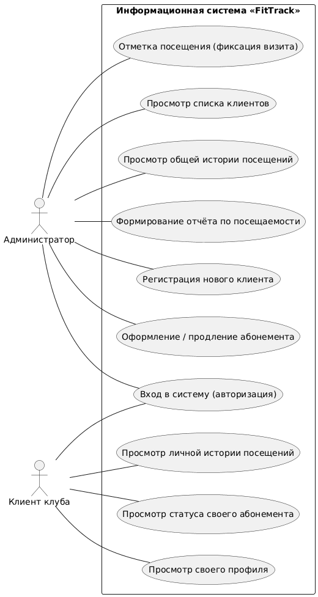

# Информационная система учёта посещений спортивного клуба «FitTrack»

<p align="center">
  
  
  
  
</p>

---

> **FitTrack** — программный комплекс, предназначенный для комплексной автоматизации процессов учёта клиентов, контроля статуса клубных карт, оперативной фиксации визитов на тренировки и формирования аналитической отчётности спортивного зала.


---

## 📋 Оглавление
- [Информационная система учёта посещений спортивного клуба «FitTrack»](#информационная-система-учёта-посещений-спортивного-клуба-fittrack)
  - [📋 Оглавление](#-оглавление)
  - [🎯 Цель и задачи проекта](#-цель-и-задачи-проекта)
    - [Ключевые задачи системы:](#ключевые-задачи-системы)
  - [👥 Роли пользователей и матрица доступа](#-роли-пользователей-и-матрица-доступа)
  - [⚙️ Функциональные возможности](#️-функциональные-возможности)
  - [🏗 Архитектура системы](#-архитектура-системы)
  - [📊 Моделирование процессов](#-моделирование-процессов)
    - [Диаграмма прецедентов (Use Case)](#диаграмма-прецедентов-use-case)
    - [Ключевые алгоритмы работы:](#ключевые-алгоритмы-работы)
  - [📁 Структура репозитория](#-структура-репозитория)
  - [🚀 Установка и запуск](#-установка-и-запуск)
    - [Системные требования](#системные-требования)
    - [Инструкция по развёртыванию](#инструкция-по-развёртыванию)
  - [👩‍💻 Сведения об авторе](#-сведения-об-авторе)

---

## 🎯 Цель и задачи проекта

**Цель разработки:** создание программного комплекса для автоматизации учёта посещений фитнес-клуба, мониторинга клиентской базы и управления абонементами в едином информационном пространстве.

### Ключевые задачи системы:
* **Кадровый и клиентский учёт:** хранение персональных и контактных данных посетителей клуба с сохранением истории изменений.
* **Управление абонементами:** первичное оформление, продление и автоматический контроль сроков действия клубных карт.
* **Фиксация посещений:** валидация права входа клиента на ресепшене, списание тренировок и ведение электронного журнала визитов.
* **Аналитика и отчётность:** подсчёт статистики загруженности спортивного зала и посещаемости за выбранные временные интервалы.
* **Контроль целостности:** разграничение прав доступа, предотвращение допуска по недействительным картам и валидация данных при совершении операций.

---

## 👥 Роли пользователей и матрица доступа

В системе реализована ролевая модель доступа (**RBAC**), разделяющая полномочия на два уровня:

| Роль | Права | Описание и доступные функции |
| :--- | :---: | :--- |
| **Администратор** *(Сотрудник ресепшен)* | **RW** *(Полный доступ)* | Регистрация и удаление клиентов, оформление и продление клубных карт, регистрация посещений с валидацией карты, просмотр общего журнала визитов и формирование сводной отчётности. |
| **Клиент** *(Посетитель клуба)* | **RO** *(Только чтение)* | Персональная авторизация, просмотр данных личного профиля, мониторинг остатка занятий и срока действия своего абонемента, просмотр личной истории посещений. |

---

## ⚙️ Функциональные возможности

Комплекс функций системы сгруппирован по бизнес-модулям:
1. **Управление клиентской базой:**
   * Регистрация нового посетителя с заполнением карточки (ФИО, телефон, привязка абонемента);
   * Редактирование профиля и контактной информации;
   * Удаление/деактивация учетной записи клиента из активной базы.
2. **Управление абонементами:**
   * Первичное оформление и привязка клубной карты к клиенту;
   * Продление срока действия карты и пополнение баланса тренировок;
   * Проверка статуса (активен, просрочен, исчерпан лимит занятий).
3. **Фиксация визитов и пропускная система:**
   * Поиск клиента и проверка валидности абонемента при входе;
   * Регистрация факта тренировки и автоматическое списание визита;
   * Ведение сквозного журнала посещаемости в реальном времени.
4. **Аналитика и отчётность:**
   * Формирование отчётов о загруженности фитнес-клуба по часам, дням и периодам.

---

## 🏗 Архитектура системы

Программный комплекс строится по принципам классической **трёхуровневой архитектуры** (*3-Tier Architecture*):

```text
┌────────────────────────────────────────────────────────┐
│         Слой интерфейса (Presentation Layer)           │
│    Консольный / Графический интерфейс, валидация ввода │
└───────────────────────────┬────────────────────────────┘
                            │ (DTO / Команды)
┌───────────────────────────▼────────────────────────────┐
│          Слой бизнес-логики (Business Logic Layer)     │
│   Валидация абонементов, учет визитов, расчет отчетов  │
└───────────────────────────┬────────────────────────────┘
                            │ (CRUD / Запросы)
┌───────────────────────────▼────────────────────────────┐
│                 Слой данных (Data Layer)               │
│     DAO / Репозиторий доступа ───► Реляционная БД      │
└────────────────────────────────────────────────────────┘
```

* **Слой интерфейса:** обеспечивает взаимодействие администратора и клиента с системой (CLI/GUI/Web), сбор входных данных и вывод системных сообщений.
* **Слой бизнес-логики:** выполняет валидацию входных форматов, проверку активности и сроков годности абонементов, обработку факта визита и генерацию аналитических отчётов.
* **Слой данных:** отвечает за надёжное долговременное хранение информации о клиентах, клубных картах и журналах визитов, обеспечивая транзакционную целостность.

---

## 📊 Моделирование процессов

### Диаграмма прецедентов (Use Case)
Отражает сценарии взаимодействия пользователей с системой «FitTrack»:

<p align="center">
  
</p>

> Исходный декларативный код диаграммы сохранён в формате PlantUML: [docs/diagrams/usecase.puml](docs/diagrams/usecase.puml).

### Ключевые алгоритмы работы:
* **Алгоритм регистрации нового клиента:** включает аутентификацию администратора, верификацию формата вводимых данных (ФИО, телефон), поиск и валидацию идентификатора абонемента в справочнике и сохранение записи в базу данных.
* **Алгоритм отметки посещения тренировки:** проверяет полномочия администратора, производит поиск клиента и абонемента по ID, выполняет проверку активности клубной карты (не истек ли срок и не исчерпан ли лимит), после чего регистрирует визит и списывает занятие.

---

## 📁 Структура репозитория

```text
fittrack/
├── .gitignore                # Исключения системных и временных файлов
├── README.md                 # Главный документ проекта (документация)
├── docs/                     # Проектная документация
│   └── diagrams/             # Исходники и рендеры диаграмм
│       ├── usecase.puml      # Use Case код на языке PlantUML
│       └── usecase.png       # Сгенерированное растровое изображение
├── src/                      # Исходный программный код
│   ├── Main.java             # Точка входа в приложение (или main.py)
│   ├── models/               # Доменные сущности (Client, Ticket, Visit)
│   └── services/             # Сервисы обработки бизнес-логики
└── tests/                    # Модульные и интеграционные тесты
```

---

## 🚀 Установка и запуск

### Системные требования
* **Среда выполнения:** OpenJDK 17+ (или Python 3.10+)
* **Система контроля версий:** Git 2.40+

### Инструкция по развёртыванию

1. **Клонировать репозиторий на локальную машину:**
   ```bash
   git clone https://github.com/<ваш-логин>/fittrack.git
   cd fittrack
   ```

2. **Скомпилировать и запустить программу:**
   * Для Java:
     ```bash
     cd src
     javac Main.java
     java Main
     ```
   * Для Python:
     ```bash
     python src/main.py
     ```

---

## 👩‍💻 Сведения об авторе
* **Выполнил:** студент Тихова В. А.
* **Учебная группа:** 26-ИВТ-4-1
* **ВУЗ:** НГТУ им. Р.Е. Алексеева (Нижний Новгород)
* **Институт:** ИРИТ
* **Дисциплина:** Информатика
* **Проверил:** ассистент Китов А. А.
* **Год выполнения:** 2026